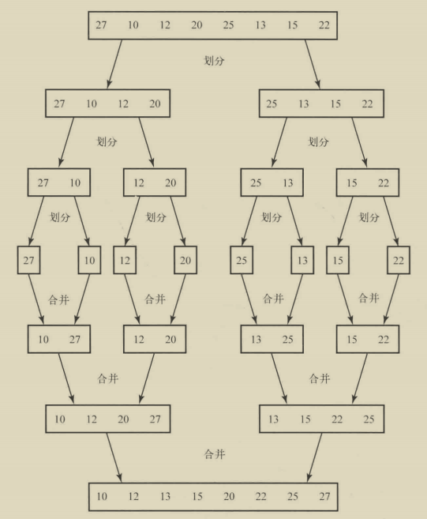
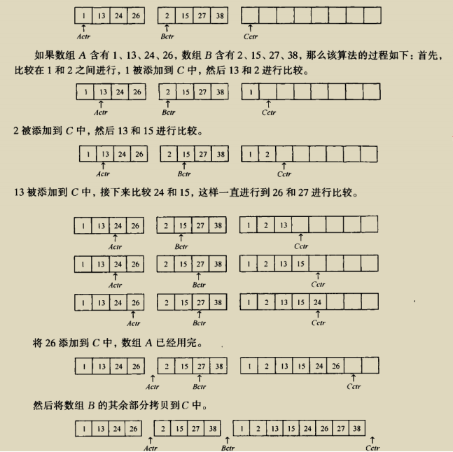
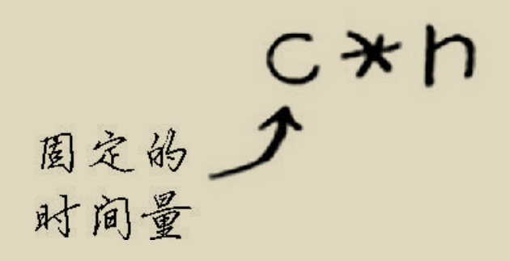
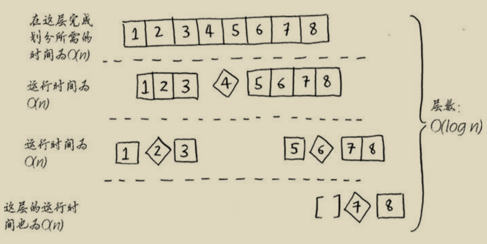

# 第四章 快速排序

## 4.1 分而治之

分而治之(divide and conquer，D&C):

问题1：如何将一块矩形的土地均匀的分成方块，并确保分出的方块是最大的？
问题2：如何`不使用循环`实现将一个数字数组中的所有元素相加，并返回结果？

上述两个问题均可使用D&C策略解决，而D&C策略是递归的，因而使用D&C解决问题的过程包括两个步骤：
(1) 找出尽可能简单的基线条件；
(2) （确定如何）将问题不断分解（或者说缩小规模），直到符合基线条件。

**D&C并非可直接用于解决问题的具体算法，而是一种解决问题的思路。**

## 4.2 快速排序

快速排序是一种常用的排序算法，比选择排序快得多，快速排序也使用了D&C策略，它是D&C思想的一个典型应用。

我们通过对数字数组进行排序来说明快速排序算法的原理：

首先，找出基线条件，使用排序算法对数组排序时，最简单的问题情形就是处理我们明确知道根本不需要执行排序的数组，即长度小于等于1的数组，因此基线条件就是遇到空数组或只包含一个元素的数组时，这时只需原样返回数组，根本不用排序。

然后，我们需要考虑如何将问题不断递归分解，直至符合基线条件，上述的基线条件是处理长度小于等于1的数组，因而我们应考虑如何将一个长数组的排序分解为多个短的子数组的排序。

在快速排序算法中如何递归分解问题呢？工作原理如下：

+ 第一步，从数组中任意选择一个元素，这个元素称为基准值（pivot）；
+ 第二部，找出所有比基准值小的元素放在基准值的一边，所有比基准值大的元素放在基准值另一边；
    这里每一边我们称为一个分区，现在我们有：
    - 一个由所有小于基准值的数字组成的子数组；
    - 基准值；
    - 一个由所有大于基准值的数字组成的子数组；

    经过分区后，得到的两个分区的子数组仍是无序的，但如果这两个子数组是有序的，那么对整个数组完成排序将非常容易，按 左边的数组+基准值+右边的数组 的方式进行组合，即可得到我们需要的结果。

    很明显，下一步需要考虑的就是如何对各个子数组进行排序，显然，我们同样可以按照上述的分解方式对每个子数组进行快排处理，如此不断分解下去，直到得到的数组是可以允许我们进行简单排序的子数组，即包含不超过两个元素的数组，这时我们对问题的分解已经到达了基线条件（`递归达到最大深度`），可以简单得到结果并返回给上一级，从而允许上一级使用下级返回的各个有序子数组再组合成更大的有序数组，这样层层返回更大的有序子数组结果，最终可以得到原始数组的排序结果。

**归纳证明**:

    归纳证明是一种证明算法行之有效的方式，它分两步：基线条件和归纳条件。对于快速排序，我们可以使用归纳证明进行推理。在基线条件中，我们证明这种算法对空数组或包含一个元素的数组管用；在归纳条件中，我们证明如果快速排序对包含一个元素的数组管用，那么对包含两个元素的数组也管用；如果对包含两个元素的数组管用，那么对包含三个元素的数组也将管用，以此类推，我们可以说快速排序对任何长度的数组都管用。

## 4.3 再谈大O表示法

快速排序的独特之处在于，其速度取决于选择的基准值。讨论快速排序的运行时间之前，下面先列出常见的大O运行时间：

上图中快速排序的运行时间为O(n * log n)，这是在平均情况下的值，在最糟糕的情况下，快速排序的运行时间为O(n^2)，与选择排序一样慢！

此外，与快速排序算法的平均运行时间类似的，还有一种名为归并排序（merge sort）的排序算法，其运行时间的大O表示也是O(n * log n)。

### 比较快速排序和归并排序

**归并排序算法介绍**：

归并排序算法也是D&C思想的一个典型应用。该算法的实现同样是递归的，因而我们依然从如下两个方面考虑该算法的实现问题：

首先，需要找出递归的基线条件，与快排算法递归的基线条件类似，对数组执行归并排序算法时递归的基线条件同样是最简单的、不需要排序的长度小于等于1的数组，算法实现中遇到符合这种条件的数组时，不需要排序，可以直接返回原数组作为结果。

然后，需要考虑如何将问题不断递归分解，直到符合基线条件，根据上述基线条件，我们同样考虑将长数组的排序问题分解为多个短数组的排序问题以及这些短数组排序结果的归并问题。

要将一个数组排序，可以先（递归地）将它分成两半分别进行排序，然后将两半的排序结果归并起来，从而得到原数组的排序结果。下面以数组的两路归并排序来说明归并排序算法的基本原理：

+ 第一步，将数组从中间位置分成左右两个子数组；
+ 第二步，分别对两个子数组（递归地）执行归并排序；
+ 第三步，对第二步得到的两个子数组的排序结果进行归并，得到被分解的长数组的排序结果。

上述递归过程中，需要不断判断是否达到基线条件，当数组被分解到长度小于等于1时，达到最大递归深度，递归调用开始一层层返回。每次递归中，两个子数组的排序结果返回后，接着执行的是针对两个有序数组的归并过程。

归并排序算法基本过程如下图所示：

对两个有序子数组的归并过程如下图所示：

**快速排序和归并排序比较**：

再谈大O表示法：以O(n)为例，我们在使用O(n)表示一个算法的运行时间时，实际上n对应的运行时间是这样的：

c是算法中一个重复过程每次执行所需的固定时间量，称为常量。通常我们不考虑这个常量，因为如果两种算法的`大O运行时间`（增长率）不同，这种常量的影响通常无关紧要，但有时候，这个常量的影响可能很大，对快速排序和归并排序就是如此。快速排序的常量通常比归并排序小，因此如果它们的运行时间都为O(n log n)，快速查找的速度将更快。实际上，快速查找的速度确实更快，因为相对于遇上最糟情况，它遇上平均情况的可能性要大得多。

**平均情况和最糟情况**：

快速排序的性能高度依赖于选择的基准值。

假设总是选择第一个元素作为基准值，如果将要处理的数组实际上已经是有序的。由于快排算法不检查输入数组是否有序，因而依然会尝试对其进行排序。这样导致的结果是，每次处理的数组都不能被分成两半，其中一个数组总是为空，从而导致调用栈很长。

如果我们总是选择将中间位置的元素作为基准值，理想情况下这时的调用栈长度将会短得多，因为我们总是将数组分成两半，不需要那么多层的递归调用。

上述第一种情况是最糟情况，调用栈长度为O(n)，第二种情况是最佳情况(在这里也是平均情况)，调用栈长度为O(logn)。

接下来，我们考察每层递归处理完全部元素所需的时间。实际上，不论我们如何选择基准值，在调用栈的每层，总体都会涉及O(n)个元素的处理时间，即在每层执行完该层全部元素的处理所需的大O运行时间为O(n)。

快速排序每层递归的运行时间：

整个算法需要的时间是`调用栈层数的大O表示`乘以`每层总体运行时间的大O表示`，因而前述两种情况下，算法总体的大O运行时间分别为O(n^2)和O(n log n)。对于快速排序，这里的最佳情况也是平均情况，即平均情况下快速排序的运行时间就是O(n log n)，因而快速排序是最快的排序算法之一。

## 4.4 小结

+ D&C将问题逐步分解。使用D&C处理列表时，基线条件很可能是空数组或只包含一个元素的数组。
+ 实现快速排序时，请随机地选择用作基准值的元素。快速排序的平均运行时间为O (n log n )。
+ 大O表示法中的常量有时候事关重大，这就是快速排序比归并排序快的原因所在。
+ 比较简单查找和二分查找时，常量几乎无关紧要，因为列表很长时，O (log n )的速度比O (n )快得多。
