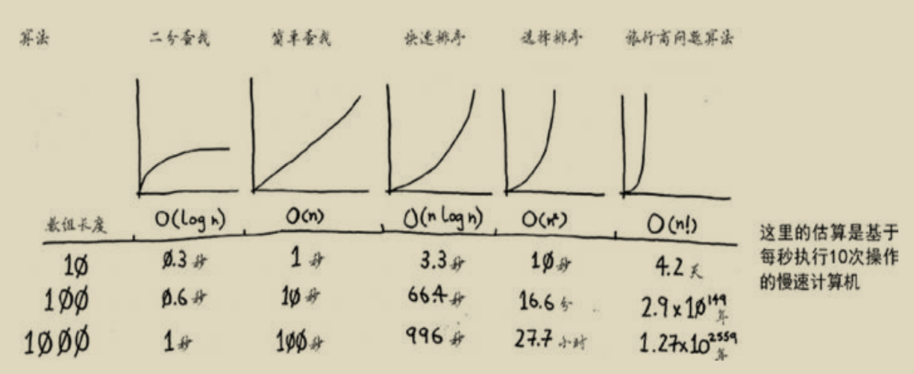

# 第四章 快速排序

## 4.1 分而治之

分而治之(divide and conquer，D&C):

问题1：如何将一块矩形的土地均匀的分成方块，并确保分出的方块是最大的？
问题2：如何`不使用循环`实现将一个数字数组中的所有元素相加，并返回结果？

上述两个问题均可使用D&C策略解决，而D&C策略是递归的，因而使用D&C解决问题的过程包括两个步骤：
(1) 找出尽可能简单的基线条件；
(2) （确定如何）将问题不断分解（或者说缩小规模），直到符合基线条件。

**D&C并非可直接用于解决问题的具体算法，而是一种解决问题的思路。**

## 4.2 快速排序

快速排序是一种常用的排序算法，比选择排序快得多，快速排序也使用了D&C策略，它是D&C思想的一个典型应用。

我们通过对数字数组进行排序来说明快速排序算法的原理：

首先，找出基线条件，使用排序算法对数组排序时，最简单的问题情形就是处理我们明确知道根本不需要执行排序的数组，即长度小于等于1的数组，因此基线条件就是遇到空数组或只包含一个元素的数组时，这时只需原样返回数组，根本不用排序。

然后，我们需要考虑如何将问题不断递归分解，直至符合基线条件，上述的基线条件是处理长度小于等于1的数组，因而我们应考虑如何将一个长数组的排序分解为多个短的子数组的排序。

在快速排序算法中如何递归分解问题呢？工作原理如下：
+ 第一步，从数组中任意选择一个元素，这个元素称为基准值（pivot）；
+ 第二部，找出所有比基准值小的元素放在基准值的一边，所有比基准值大的元素放在基准值另一边；
    
    这里每一边我们称为一个分区，现在我们有：
    - 一个由所有小于基准值的数字组成的子数组；
    - 基准值；
    - 一个由所有大于基准值的数字组成的子数组；

    经过分区后，得到的两个分区的子数组仍是无序的，但如果这两个子数组是有序的，那么对整个数组完成排序将非常容易，按 左边的数组+基准值+右边的数组 的方式进行组合，即可得到我们需要的结果。

    很明显，下一步需要考虑的就是如何对各个子数组进行排序，显然，我们同样可以按照上述的分解方式对每个子数组进行快排处理，如此不断分解下去，直到得到的数组是可以允许我们进行简单排序的子数组，即包含不超过两个元素的数组，这时我们对问题的分解已经到达了基线条件（`递归达到最大深度`），可以简单得到结果并返回给上一级，从而允许上一级使用下级返回的各个有序子数组再组合成更大的有序数组，这样层层返回更大的有序子数组结果，最终可以得到原始数组的排序结果。

**归纳证明**:

    归纳证明是一种证明算法行之有效的方式，它分两步：基线条件和归纳条件。对于快速排序，我们可以使用归纳证明进行推理。在基线条件中，我们证明这种算法对空数组或包含一个元素的数组管用；在归纳条件中，我们证明如果快速排序对包含一个元素的数组管用，那么对包含两个元素的数组也管用；如果对包含两个元素的数组管用，那么对包含三个元素的数组也将管用，以此类推，我们可以说快速排序对任何长度的数组都管用。

## 4.3 再谈大O表示法

快速排序的独特之处在于，其速度取决于选择的基准值。讨论快速排序的运行时间之前，下面先列出常见的大O运行时间：

上图中快速排序的运行时间为O(n * log n)，这是在平均情况下的值，在最糟糕的情况下，快速排序的运行时间为O(n^2)，与选择排序一样慢！

此外，与快速排序算法的平均运行时间类似的，还有一种名为归并排序（merge sort）的排序算法，其运行时间的大O表示也是O(n * log n)。

### 比较快速排序和归并排序

**归并排序算法介绍**：

归并排序

