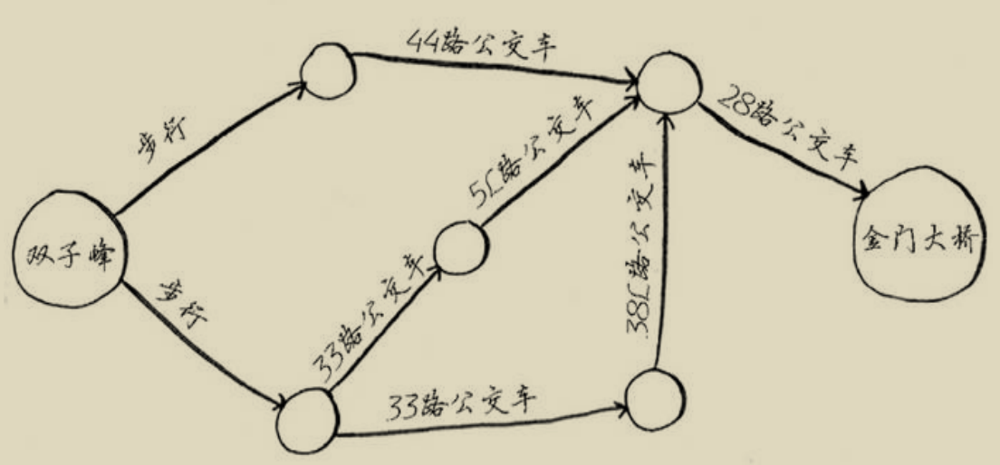
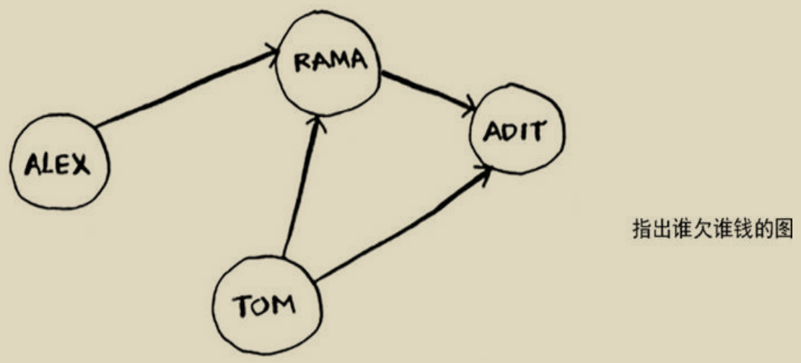

# 第六章 广度优先搜索

## 6.2 图是什么

图用来仿真一组连接，表示不同的东西是如何相连的。图由节点和边组成。一个节点可能与众多节点直接相连，这些直接相连的节点称为邻居。

## 6.3 广度优先搜索

第一章介绍过一种查找算法——二分查找。**广度优先搜索是一种用于图的`查找算法`**，可以帮助回答两类问题：

+ 第一类问题，从节点A出发，有前往节点B的路径吗？
+ 第二类问题，从节点A出发，前往节点B的哪条路径最短？

**下面以在你的人脉网中寻找芒果销售商的问题为例，对上述两类问题进行说明：**

**查找最短路径：**

