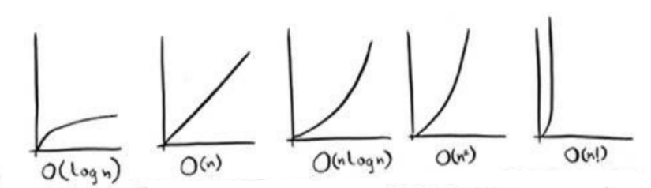

# 第一章 算法简介

## 1.2 二分查找

>**问题**：在电话簿中找一个名字以K开头的人，或者在字典中找一个以O开头的单词，采用何种方式查找可以比较高效？
>
>**解答**：上述问题均是`查找`问题，最直接的解决方式是`简单查找`，即从列表的开头逐一查找，直到找到目标值，或者列表遍历结束，这种方式在列表包含的元素数量较少时，查找效率尚可接受，而在列表包含大量元素时，我们应当考虑更高效的查找方法，针对上述在`有序列表`中查找目标值的问题，我们可以使用更高效的`二分查找`算法来解决，二分查找算法要求其输入是一个`有序的`元素列表。

### 简单查找和二分查找的比较

|类型|优缺点|时间复杂度|
|------|-----------------|------|
|简单查找|简单粗暴，适用性较好，但效率会随数据集中数据量的增长而下降明显|O(n)|
|二分查找|效率不会随数据集中的数据量的增长而明显下降，但要求数据集中的元素有序|O(log n)|

这里使用大O表示法讨论算法的运行时间，对于包含n个元素的数据集，使用简单查找法查找元素时，在最差的情况下需要查看每个元素；使用二分查找法时，最多需要查看log n个元素。简单查找最多需要查看元素的次数与数据集的元素数量相同，所需时间称为`线性时间`；二分查找所需的时间则称为`对数时间`（或log时间）。

## 1.3 大O表示法

1. 大O表示法指出了算法有多快，但它所指的并非以秒为单位的速度，而是指出了算法随着操作数规模的增长，所需运行时间的增长速度。

2. 大O表示法指出的是最糟情况下的运行时间，这是一个保证，保证算法实际运行时间不会超过该最糟情况下所需的时间。(注：除了最糟情况下的运行时间，还需考虑平均情况的运行时间)

3. 一些常见的大O运行时间

    

    |大O表示|算法举例|
    |-----------|------------|
    |O(log n)|二分查找|
    |O(n)|简单查找|
    |O(n * log n)|快速排序|
    |O(n^2)|选择排序|
    |O(n!)|旅行商问题|

## 1.4 小结

+ 二分查找的速度比简单查找快得多。
+ O (log n )比O (n )快。需要搜索的元素越多，前者比后者就快得越多。
+ 算法运行时间并不以秒为单位。
+ 算法运行时间是从其增速的角度度量的。
+ 算法运行时间用大O表示法表示。
